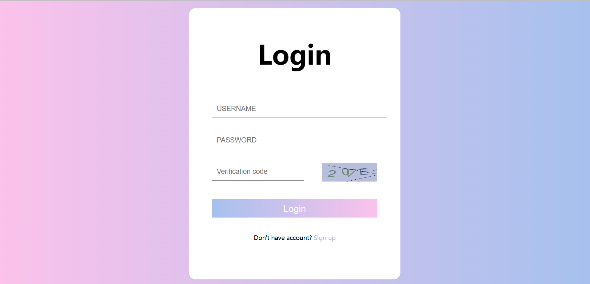
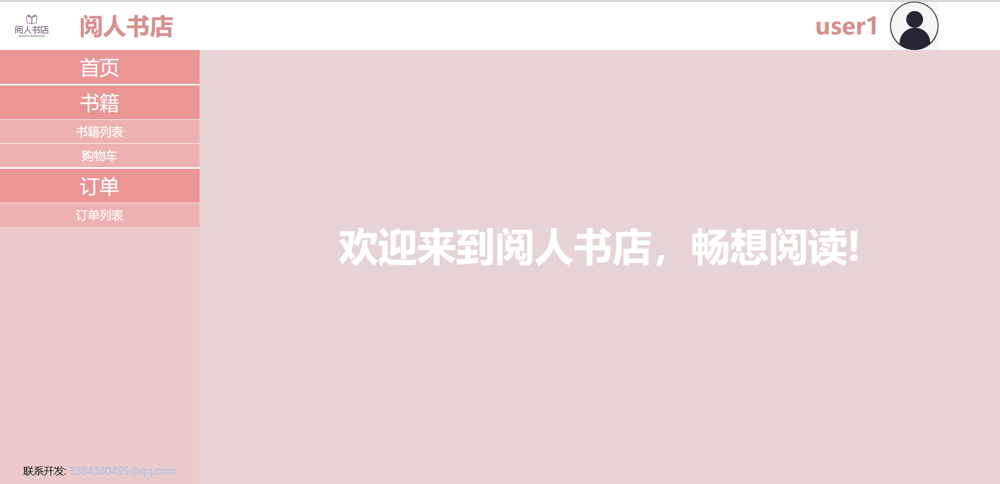
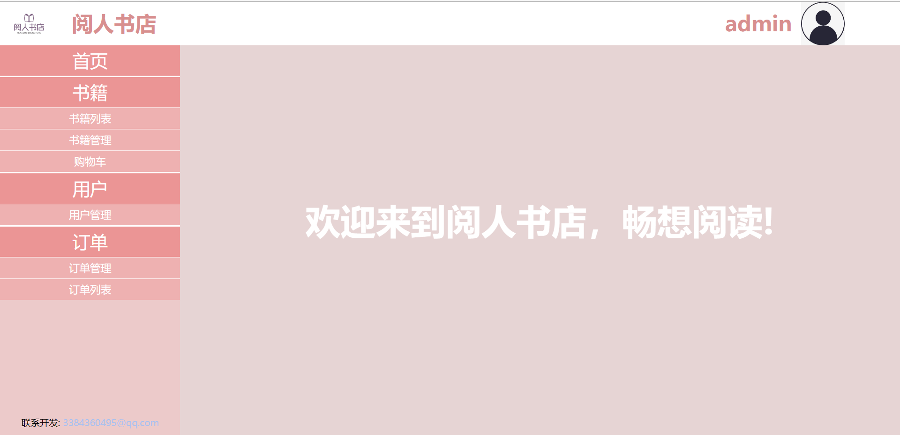
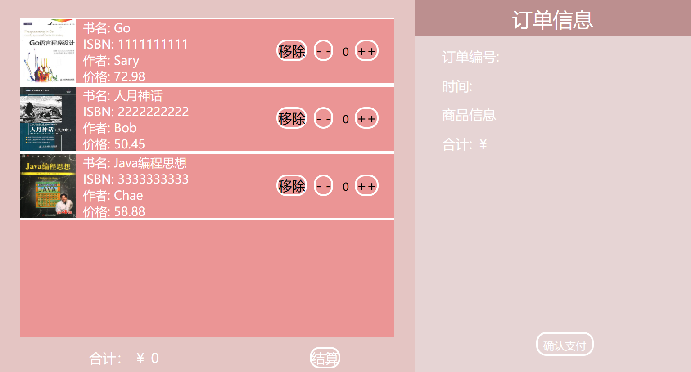
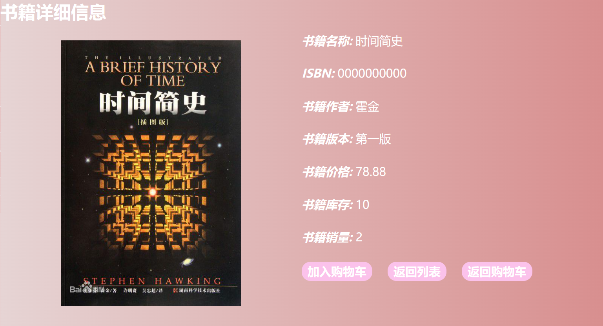
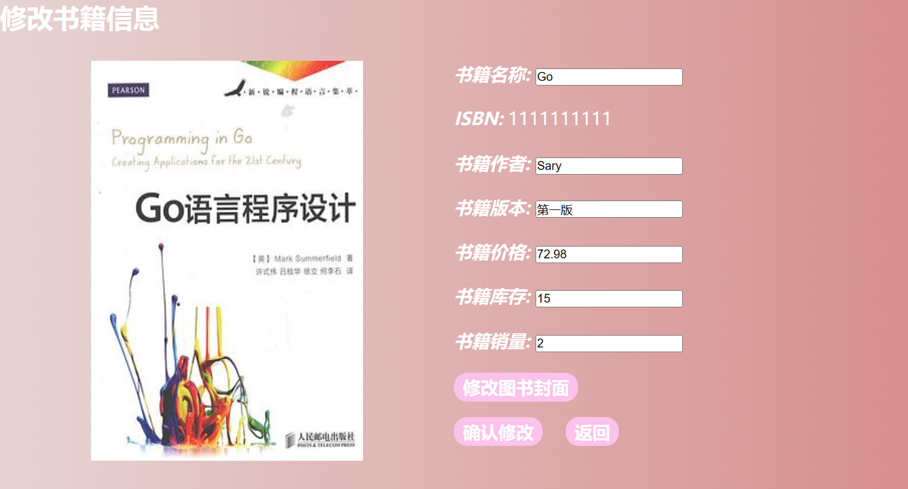
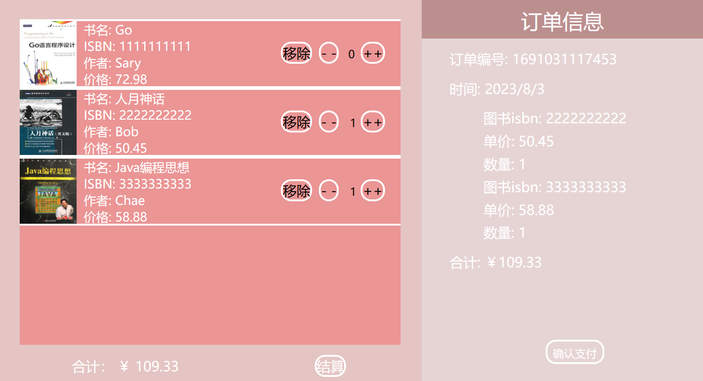

# BookProject
 使用servlet构建，适合servlet初学者，逻辑简单。前端部分采用HTML+css+js+jquery。

[点击查看项目详情](http://47.115.214.103:8080/book_project/login)

### 技术栈

前端：html, css,js,jquery,ajax

后端：java,servlet

数据库：mysql，durid

### 项目简介

书城项目，来源自尚硅谷servlet学习视频，没有使用jsp,el,jspl这些太老的技术。

用户：可以在商场查看书籍，点击书籍查看详细信息，可加入购物车并支付购买，可以查看历史订单。

管理员：除了与用户相同的功能外，还可以管理书籍信息，用户信息，订单信息。

用户与管理员界面不同

项目实现cookie和session，实现登录后一周可以自动登录进入首页。

### 项目展示

+ 登录界面

  

​		js生成验证码并展示，使用jquery的ajax提交数据，并对输入内容进行检查。

+ 项目首页-普通用户

  

​		包括查看书籍，购买图书，支付订单等。

+ 项目首页-管理员

  

​		还包括对信息的管理模块

+ 退出、注销登录

  

+ 购物车

  

+ 查看书籍详细信息

  

+ 更新书籍信息

  

+ 生成订单

  

+ 支付

  

​		使用qrcode生成支付二维码，但并不具备支付功能（徒有其表），确认支付后会弹出二维码，保持界面5秒会判定支付成功，如果在这期间关闭二维码界面，视为支付失败。

#### 简单的视频操作（管理员）

#### 管理员账号

账号：admin  密码：admin

### 项目使用

项目克隆到本地后，配置tomcat，使用maven导入依赖包即可。tomcat配置工件时，上下文设置为/book_project

### 不足

过多重复代码（每一个页面有一个servlet返回页面）；页面存在闪烁问题。
